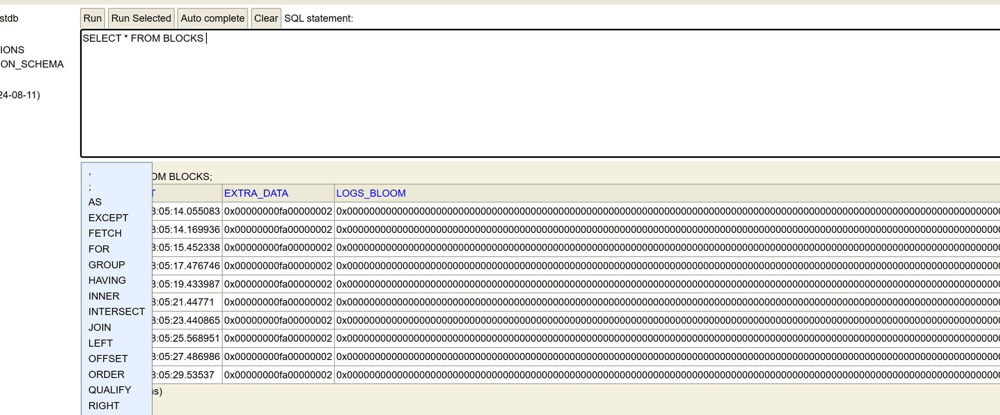
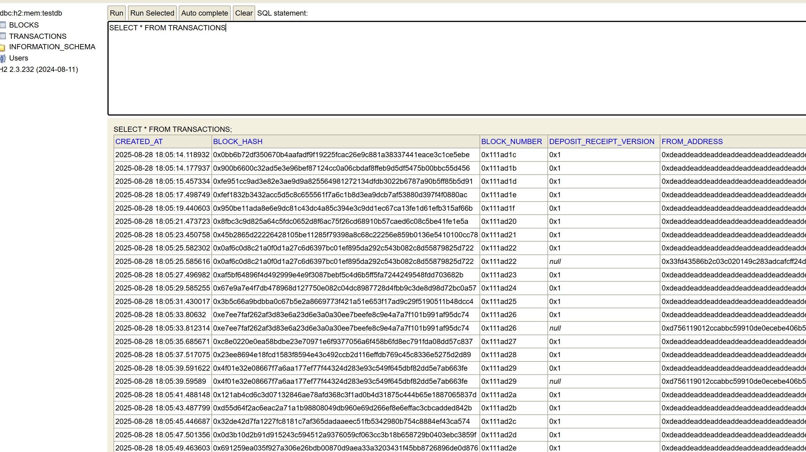
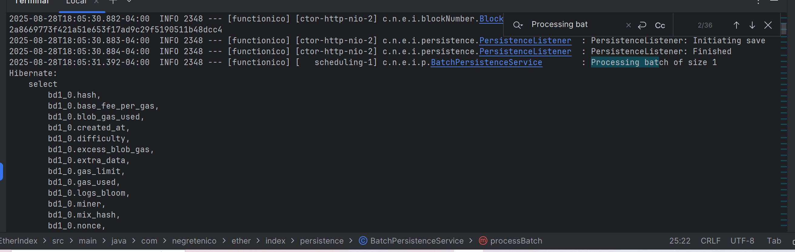

# EtherIndex

EtherIndex is a Spring Boot application that connects to the **Worldchain Sepolia** testnet and provides a lightweight Ethereum indexing pipeline.

---

## 🚀 Features

- **Real-time block tracking**
    - Connects to the Worldchain-Sepolia WebSocket.
    - Listens for new blocks and fetches the related transactions.

- **Resilient data ingestion**
    - Transactions are placed onto an internal queue before persistence.
    - Helps avoid overloading the database with high write volume.
    - Improves resilience and scalability.

- **Event-driven architecture**
    - Uses Spring Events to decouple system components (block fetching, transaction parsing, persistence).
    - Simplifies extension and testing.

- **REST API**
    - Exposes endpoints to view stored blocks and transactions.
    - Makes the indexed blockchain data easily accessible.

---

## 📸 Screenshots

### Block and Transaction Data Stored



### Queue Processing in Action

---

## 🛠️ Running the Application

### Local (with Maven)
```bash
mvn spring-boot:run -Dspring-boot.run.profiles=local
```
### Docker (preferred)
```bash
docker pull ghcr.io/negretenico/etherindex:latest
docker run -p 8080:8080 ghcr.io/negretenico/etherindex:latest
```
___

## 📦 Deployment

The container is published to GitHub Packages: 👉 ghcr.io/negretenico/etherindex

---
## 📖 API Endpoints
| Method | Endpoint                  | Description                     |
| ------ | ------------------------- | ------------------------------- |
| GET    | `/api/blocks`             | List all stored blocks          |
| GET    | `/api/blocks/{blockHash}` | Retrieve a specific block       |
| GET    | `/api/transactions`       | List all stored transactions    |
| GET    | `/api/transactions/{id}`  | Retrieve a specific transaction |


---
## 🔧 Tech Stack

* Java 17 
* Spring Boot 
* Spring Events (for decoupling)
* Internal Queues (for resilience)
* Docker (for containerization)
* H2 (for storage)